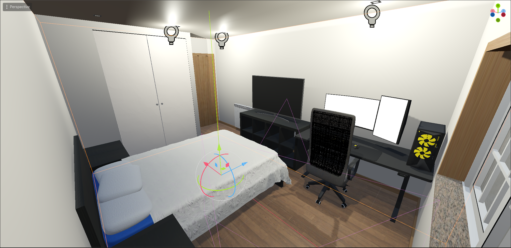
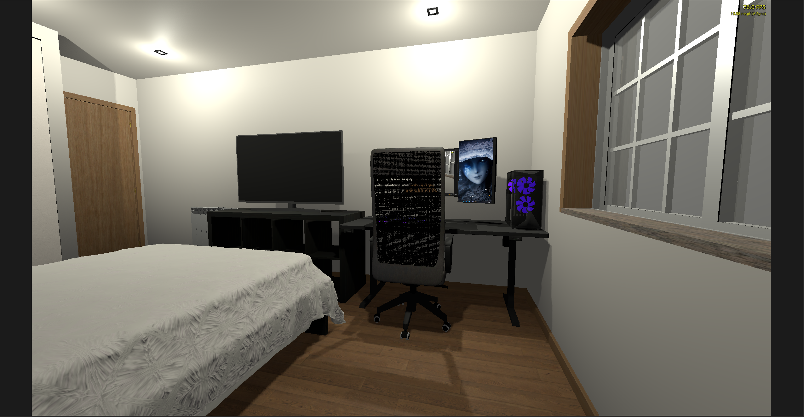
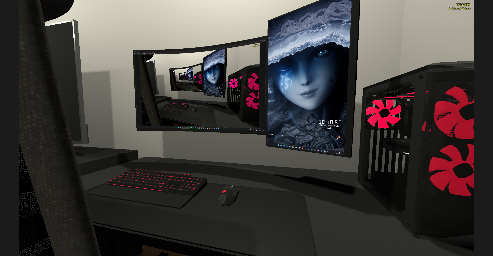

# Virtual Room – Real-Time Desktop World (Godot)

This project is an ongoing **3D recreation of my real-world room inside Godot**, where almost all models were created by me. The environment is designed to function as a **live, interactive digital space** rather than a static scene.

A key feature of the project is the inclusion of a **real-time view of my actual desktop**, embedded directly into the 3D world.

---

## Project Overview

- Fully modeled 3D room, based on my real environment
- Almost all assets and models created manually
- Designed as a functional space, not just a visual replica
- Integrates a live desktop feed into the world
- Built with future VR support in mind

---

## Live Desktop Integration

The desktop shown inside the 3D room is a **live feed of my actual Windows desktop**, captured in real time and displayed as a texture in Godot.

### Current Setup

- OBS captures the desktop
- Spout is used for GPU-based texture sharing
- The **spout-gd plugin** receives the stream directly in Godot

This approach allows the desktop to appear in-world with **very low latency and minimal performance impact**.

---

## Why Spout-GD Instead of a Custom Module

Earlier in development, I created my own **custom Godot screen capture module**.  
However, for this project I switched to **spout-gd** because it provides:

- More features out of the box
- Easier setup and iteration
- Better tooling and stability
- Lower performance overhead in practice

Using Spout through OBS also makes it easier to:

- Control capture sources
- Apply transforms and filters
- Debug and adjust the pipeline without rebuilding Godot

---

## VR Focus (Work in Progress)

One of the main goals of this project is to **experiment with VR interaction inside a familiar, real-world environment**.

The project is being structured to:

- Support VR camera setups
- Train interaction layouts and spatial design
- Prepare for room-scale and seated VR testing

⚠️ **Note:**  
VR hardware has not arrived yet, so VR-specific testing and implementation are currently limited to preparation and design work.

---

## Technology Stack

- Godot Engine
- Custom 3D models
- OBS + Spout
- spout-gd plugin
- Windows platform

---

## Goals

- Create a functional digital twin of a real room
- Blend real-time desktop content into a 3D environment
- Experiment with productivity and immersion concepts
- Prepare a foundation for VR interaction and testing

---

## Planned Improvements

- Full VR interaction once hardware arrives
- Improved interaction with desktop surfaces
- Lighting and performance optimizations
- Expanded room functionality

---

## Images

### 3D Room Overview

### Live Desktop Inside 3D Room

### Live Desktop Closeup

---

## Credits

- **PolyHaven** – textures  
  https://polyhaven.com/

- **Computer Liquid Cooler** (modified)  
  https://sketchfab.com/3d-models/liquid-cooler-1c60872e45144239aadb4e188c43bce3

- **Computer Fan** (modified)  
  https://sketchfab.com/3d-models/computer-cooler-pc-fan-50adf2b7b06f42588825ab7f31f7ca87

- **Computer RAM Sticks** (modified)  
  https://sketchfab.com/3d-models/ram-corsair-vengeance-lpx-ee11e1926e514075a70642ecb5dc5c2d

- **Computer Motherboard**  
  https://sketchfab.com/3d-models/msi-b550-gaming-plus-a7f6a35bca4a4d01a010a6b8ded6bc93
